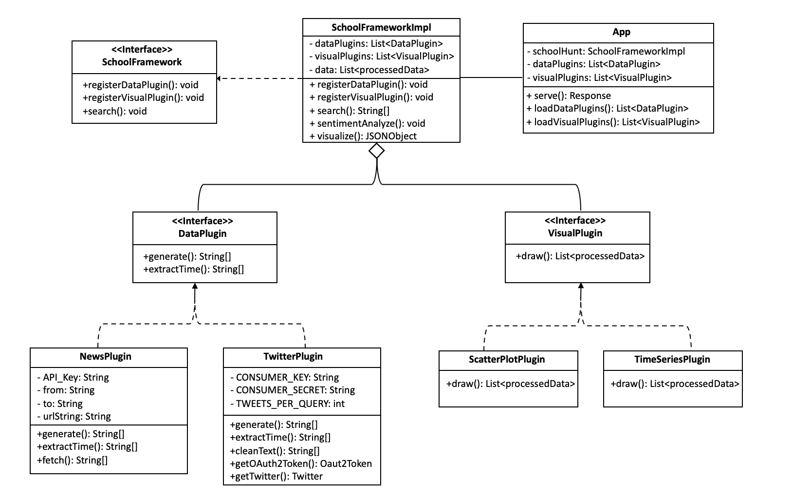

# ChooseU Framework
The main use of this framework is to provide users a tool to look for college and university information according to their preferences. The framework performs the analysis from different sources (provided by data plugins) and shows results in different ways (using visualization plugins). The framework can perform graphing and sentiment analysis, so that it can offer benefits for reuse. 

We mainly used following APIs to fetch related information:
- [Twitter API](https://developer.twitter.com/en/docs)
- [News API](https://newsapi.org/docs)
- [Cloud Natural Language API](https://cloud.google.com/natural-language/docs/sentiment-tutorial)
    - Our framework does sentiment analysis with this machine learning web API. 
    - Detailed set-up information could be found below
 
 
Data plugins would provide a list of text fragments with corresponding time stamps.

The framework could provide users with some charts, as well as sentiment scores about that college or university. 

Visualization plugins would include:

- Time-series graph displaying the sentiment over time
- Scatter plot displaying the sentiment scores

## Extend the framework
To extend the framework provides, register your plugin with the framework, add the fully-qualified class name of your plugin to the edu.cmu.cs514.hw6.plugin.DataPlugin or edu.cmu.cs514.hw6.plugin.VisualPlugin file in the src/main/resources/META-INF/services/ directory; 

In App.java, two methods called loadDataPlugins() and loadVisualPlugins() will use java.util.ServiceLoader which will then use Java reflection to instantiate your plug-in and register it with the framework.

## UML Diagram
In order to have a brief idea of our whole framework and plugin structure, the following diagram shows the UML design of our plugin interfaces and how it could be used:



# Set Up Backend Server
Either run the Java backend by using your IDE or by typing
```java
mvn exec:exec
```
in the App.java

Since we still need to configure google credentials, we recommend you to use your IDE to run the backend by following next steps

## Passing credentials via environment variable
Configure GOOGLE_APPLICATION_CREDENTIALS as environment variable whose value is the file path for service account key which is the file in the main branch: [service-account-file.json](/service-account-file.json).

An example screenshot of set-up would be look like in the following screenshot:


## Passing different time range and number of queries in plugins

### TwitterPlugin
Since there's a limit of search times when we are using Twitter API, now we set the default number of query we fetch every time is 10. You can change this number to other value if you want in TwitterPlugin.java
```java
private static final int TWEETS_PER_QUERY = 10;
```

### NewsPlugin
The News API only allows us to fetch information in recent 30 days, so we set default date range from 2022/04/01 to 2022/04/15. If you would like to search for another time range, you can change the value in NewsPlugin.java. (Just to make sure the date you enter is within 30 days!)
```java
private final String from = "2022-04-01";
private final String to = "2022-04-15";
```


# Set Up Frontend Server
In the frontend folder, run
```java
npm install
npm run compile
npm run start
```
This will start a server at http://localhost:3000/


