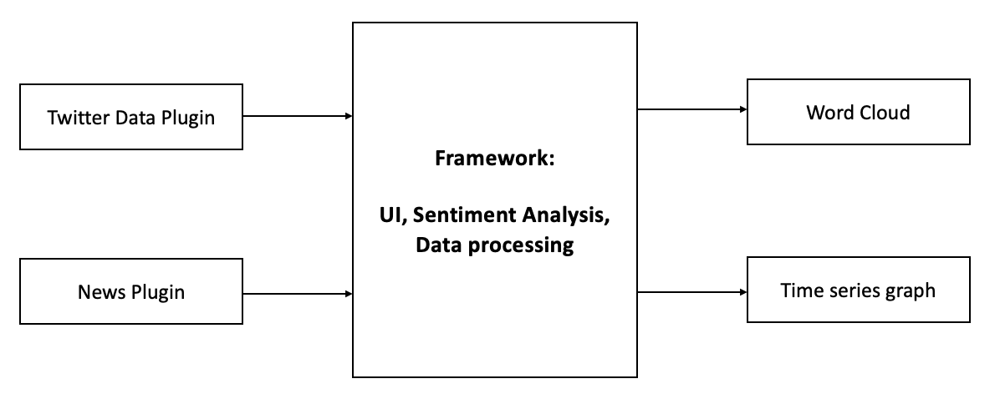

# Design Document

## Domain
The main idea is to provide users a tool to look for school/university information according to their preferences. The framework performs the analysis from different sources (provided by data plugins) and shows results in different ways (using visualization plugins). The framework can perform mapping and sentiment analysis, so that it can offer benefits for reuse. What’s more, it can be continuously reused after adding a new data plugin.
 
There are several APIs we plan to use, including News API and twitter APIs.
 
Data plugins could provide a list of text fragments with corresponding time stamps. Data plugins could include:


- Twitter plugin that takes in a generic feed of Twitter messages using Twitter API
- News plugin which can take a keyword, then search for articles on the web which mention that keyword or phase. In our context, it is probably the name of school


The framework could provide users with some charts/maps, as well as sentiment scores about that school or university. Visualization plugins could include:

- Word cloud containing high-frequency words appear the most from original text
- Time-series graph displaying the sentiment over time


## Generality vs specificity
- Domain Engineering
    - From Twitter API, we can get detailed text information about one specific school, then we perform word cloud analysis so that users can get the most popular word or phrases people may care about that school, let them have more sense about that school or university, whenever they want to apply for that school, or just want to get some general information about it. Similarly, by using News API and fetching the related text, users can get knowledge about that school they want to search from a totally different source, since news is generally more formal while people on twitter is more emotional sometime.
    - From the Twitter data plugin, we can perform a heat map by using our framework, then display the magnitude for the most common sentiments and time of day. Similarly, from the News data plugin, a heat map will be displayed as well to show the final results.
    - To sum up, the whole design has a reasonable scope that is not too narrow, since it can allow multiple plugins to the framework then return some visualizations. Meanwhile, it is also not too generic, because we have reuse value in the scope.

- Key abstractions
    - A key abstraction is a class or object that forms part of the vocabulary of the problem domain. In our framework, the variables keeping track of different data plugins and different visualization plugins represent text data that we get and display the final result of sentimental analysis etc.

- Reusable functionality
    - The framework would provide data merging for all the data sources from different plugins
    - It can perform sentiment analysis, word count analysis and graphing no matter where the data comes from, and it also has methods to filter the data, based on the time range, so that it can offer benefits for future extensibility.
    - It can be continuously reused after adding a new data plugin.

- Flexibility of plugins
    - We plan to provide different formats of visualization, such as heatmap, time-series chart, and word cloud.
    - The data plugin would extract the timestamp data from the original text generated from the API, so it makes sure different data sources provide the same format text to the framework.


## Project Structure

- Framework package
    - SchoolFramework(interface)
    - SchoolFrameworkImple(Implementation)
    - SchoolPlugin
- Plugin package
    - NewsPlugin implements SchoolPlugin
    - TwitterPlugin implements SchoolPlugin
- Main App (application enter point)

## Plugin interfaces
- Key Methods
    ```java
    /**
    * Gets the data of the plug-in
    */

    getData()


    /**
    * Gets the text of the plug-in
    */

    getText()
    

    /**
    * Gets the timestamp information
    */

    getTimestamp()


    separateTimestamp() 
    ```


- News Plugin
    - An example of API request code is shown below
        ```
        using System.Net;
                                    
        var url = "https://newsapi.org/v2/everything?" +
                "q=Apple&" +
                "from=2022-04-11&" +
                "sortBy=popularity&" +
                "apiKey=259a82454ee84656adf470b2d45b4f19";
                                    
        var json = new WebClient().DownloadString(url);
                                    
        Console.WriteLine(json);
        ```
    - An example of API output can be get from following link: https://newsapi.org/docs/get-started 
        ```
        "status": "ok",
        "totalResults": 37,
        -"articles": [
        -{
        -"source": {
        "id": null,
        "name": "Fox Business"
        },
        "author": "Adam Sabes",
        "title": "Jeff Bezos responds to Elon Musk's poll asking if Twitter HQ should be converted into homeless shelter - Fox Business",
        "description": "Amazon founder Jeff Bezos responded to Elon Musk's Twitter poll asking if the social media giant's headquarters should be converted to a shelter for the homeless.",
        "url": "https://www.foxbusiness.com/economy/jeff-bezos-responds-to-elon-musks-poll-asking-if-twitter-hq-should-be-converted-into-homeless-shelter",
        "urlToImage": "https://a57.foxnews.com/static.foxbusiness.com/foxbusiness.com/content/uploads/2022/04/0/0/Musk-Twitter-stake.png?ve=1&tl=1",
        "publishedAt": "2022-04-11T00:53:10Z",
        "content": "Amazon founder Jeff Bezos responded to Elon Musk's Twitter poll asking if the social media giant's headquarters should be converted to a homeless shelter.\r\n\"Convert Twitter SF HQ to homeless shelter … [+2519 chars]"
        },
        -{
        -"source": {
        "id": "usa-today",
        "name": "USA Today"
        },
        "author": "Nancy Armour, USA TODAY",
        "title": "Scottie Scheffler wins first Masters title, continuing his spectacular season - USA TODAY",
        "description": "Scottie Scheffler won his first PGA Tour title two months ago. Now he's a major champion after winning the Masters at Augusta National.",
        "url": "https://www.usatoday.com/story/sports/2022/04/10/scottie-scheffler-wins-masters-first-major-title-augusta-national/9536138002/",
        "urlToImage": "https://www.gannett-cdn.com/presto/2022/04/10/USAT/dbabd034-7660-4194-850d-76df29700c23-green_jacket.jpg?auto=webp&crop=4345,2444,x113,y161&format=pjpg&width=1200",
        "publishedAt": "2022-04-11T00:43:40Z",
        "content": "AUGUSTA, Ga. — Scottie Scheffler found the perfect complement for his world No. 1 ranking.\r\nA green jacket.\r\nScheffler won the Masters by three strokes Sunday, a spectacular chip shot on No. 3 giving… [+3972 chars]"
        },
        -{
        -"source": {
        "id": null,
        "name": "KCRA Sacramento"
        },
        "author": "KCRA Staff",
        "title": "Smoke from massive fire at port in Benicia seen for miles - KCRA Sacramento",
        "description": "A day after the fire started authorities said it was fully contained.",
        "url": "https://www.kcra.com/article/smoke-from-structure-fire-benicia-seen-from-fairfield/39681814",
        "urlToImage": "https://kubrick.htvapps.com/htv-prod-media.s3.amazonaws.com/images/structure-fire-1649543225.png?crop=0.854xw:1.00xh;0.112xw,0&resize=1200:*",
        "publishedAt": "2022-04-11T00:26:00Z",
        "content": "SOLANO COUNTY, Calif. —A large fire at port in Benicia was contained a day after it started, authorities said. Wind drove the smoke to be seen for miles.\r\nThe fire started on the 1200 block of Baysho… [+1180 chars]"
        },
        -{
        -"source": {
        "id": "the-washington-post",
        "name": "The Washington Post"
        },
        "author": "Taylor Telford, Annabelle Timsit, Bryan Pietsch, Julian Duplain",
        "title": "As war enters bloody new phase, Ukraine again calls for more weapons - The Washington Post",
        "description": "As battles tilt toward full-scale military confrontation on open terrain, Ukrainian officials are again calling for Western alliances to step up weapons supplies to help the country strengthen its position on the battlefield.",
        "url": "https://www.washingtonpost.com/national-security/2022/04/10/ukraine-russia-war-zelensky/",
        "urlToImage": "https://www.washingtonpost.com/wp-apps/imrs.php?src=https://arc-anglerfish-washpost-prod-washpost.s3.amazonaws.com/public/GWTLS6FY7II6ZKJNY5R55AMMEE.jpg&w=1440",
        "publishedAt": "2022-04-11T00:22:15Z",
        "content": "Russian forces bombarded several towns in eastern Ukraine on Sunday, destroying an airport and damaging several civilian targets, as the war careens toward a pivotal new phase. The shift of the war a… [+11553 chars]"
        }
        ```

    -  Receives and parses JSON formatted reply from API, the above screenshot shows an example of Json reply
    - The full documentation of this API can be found in this link: https://newsapi.org/docs 

- Twitter Plugin
    - Use keyword search for query tweets. The query can have operators that modify its behavior to filter the twitter response results. We can specify the operators in the 'q' parameter. The following code shows an example of fetching tweets containing the keyword “Carnegie Mellon”. 
        ```
        search_headers = {
            'Authorization': 'Bearer {}'.format(access_token)    
        }

        search_params = {
            'q': 'carnegie mellon',
            'lang': 'eu',
            'result_type': 'mixed'
        }

        search_url = 'https://api.twitter.com/1.1/search/tweets.json'  
        search_resp = requests.get(search_url, headers=search_headers, params=search_params)
        ```
    - Next, we will save the response in json format and print it. The response contains the searched tweets and its various parameters in JSON format, then parse through the JSON response to print the searched tweets.The response contains various parameters of the tweets returned
    - The full documentation of this API can be found in this link: https://developer.twitter.com/en/docs/twitter-api/tweets/lookup/introduction 
- Visualization Plugin - Plotly

    Install the plotly.js, just simply via ```npm install plotly.js-dist ```

    - Time Series display 
        - An example of a time-series plot
        ```
        d3.csv("https://raw.githubusercontent.com/plotly/datasets/master/finance-charts-apple.csv", function(err, rows){

        function unpack(rows, key) {
        return rows.map(function(row) { return row[key]; });
        }


        var trace1 = {
        type: "scatter",
        mode: "lines",
        name: 'AAPL High',
        x: unpack(rows, 'Date'),
        y: unpack(rows, 'AAPL.High'),
        line: {color: '#17BECF'}
        }

        var trace2 = {
        type: "scatter",
        mode: "lines",
        name: 'AAPL Low',
        x: unpack(rows, 'Date'),
        y: unpack(rows, 'AAPL.Low'),
        line: {color: '#7F7F7F'}
        }

        var data = [trace1,trace2];

        var layout = {
        title: 'Basic Time Series',
        };

        Plotly.newPlot('myDiv', data, layout);
        })
        ```
    - Heatmap display
        - An example of colored and labeled heatmaps with custom colorscales.
        ```
        var data = [
        {
            z: [[1, null, 30, 50, 1], [20, 1, 60, 80, 30], [30, 60, 1, -10, 20]],
            x: ['Monday', 'Tuesday', 'Wednesday', 'Thursday', 'Friday'],
            y: ['Morning', 'Afternoon', 'Evening'],
            type: 'heatmap',
            hoverongaps: false
        }
        ];

        Plotly.newPlot('myDiv', data);
        ```
    - The full documentation of this API can be found in this link: https://plotly.com/javascript/

